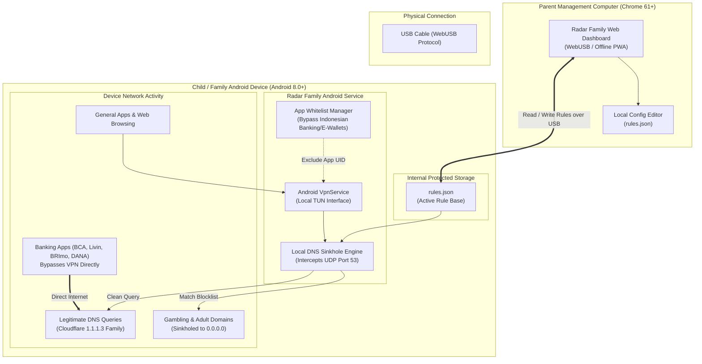

# Radar Family

[](LICENSE)
[-brightgreen.svg)](https://developer.android.com)
[](https://caniuse.com/webusb)
[](#security--privacy)

> **A privacy-first family digital wellbeing toolkit.**  
> Local DNS Sinkhole for content filtering + USB-based device management dashboard. **No data leaves the device.**

Radar Family is engineered specifically to help families protect children and loved ones from online gambling (*judi online* / *judol*), adult content, and predatory platforms without compromising user privacy, logging personal browsing habits, or breaking sensitive financial services like Indonesian m-banking and e-wallet applications.

---

## Architecture Overview

Radar Family consists of two lightweight, completely offline-first components:

1. **Android Client (`android-client`)**: An on-device VPN service acting as a local DNS sinkhole. DNS queries on port 53 are parsed locally. Blocked domains are resolved to `0.0.0.0`, whitelisted banking apps bypass the tunnel entirely, and legitimate requests resolve via secure upstream DNS (default: Cloudflare 1.1.1.3).
2. **Web Dashboard (`dashboard`)**: A standalone browser-based management console that communicates directly with the Android device over a physical USB cable using the **WebUSB API**. Rules can be audited, modified, and synchronized without requiring third-party cloud backends.



---

## Features

### 🛡️ Android Client
- **Local DNS Sinkhole**: Intercepts DNS queries on `127.0.0.1:53` through a native Android `VpnService`. Does not tunnel payload web traffic through remote VPN servers.
- **Zero Cloud Footprint**: All DNS parsing, domain matching, and sinkholing occur entirely on the local CPU.
- **Indonesian Banking App Whitelist**: Automatic package-level exclusion for major Indonesian banking and e-wallet applications (`com.bca.mobile`, `com.mandiriapps.livin`, `com.brimobile.bri`, `id.dana`, `com.gojek.app`, `com.shopee.id`, `com.ovo.app`, `id.flip`, etc.) to prevent security alerts, false positives, or VPN-detection lockouts.
- **Wildcard Pattern Support**: Effortlessly sinkholes entire domain networks (e.g. `*.slot88.com`, `*.judionline.com`, `*.sbobet.com`).
- **Low Battery Overhead**: Operates exclusively at the DNS layer; once an IP is resolved, high-bandwidth data connections flow directly over normal cellular or Wi-Fi interfaces.
- **Offline Persistence**: Default blocklist bundled in APK assets (`assets/rules.json`) and synchronized updates persisted in internal app storage.

### 💻 Web Management Dashboard
- **WebUSB Direct Communication**: Connects directly from any WebUSB-capable browser (Chrome, Chromium, Edge) to the Android device over standard USB—no backend server, no cloud subscription, no daemon installation required.
- **Visual Rule Editor**: View, search, add, or remove blocked domains and wildcard patterns in real-time.
- **Indonesian Context Presets**: Pre-populated lists targeting prevalent Indonesian gambling networks (*judol*, *slot gacor*, *togel*, *bandar qq*) and adult portals.
- **One-Click Push Synchronization**: Compiles and deploys the updated `rules.json` file straight to the device's protected internal storage.
- **Auditing & Status Inspection**: Verify tunnel health, ruleset version, upstream DNS configuration, and active whitelist statuses.

---

## Prerequisites

| Requirement | Minimum Specification | Details |
| :--- | :--- | :--- |
| **Parent PC / Browser** | Google Chrome 61+ / Chromium Edge | WebUSB API support required for direct device connection |
| **Target Android Device** | Android 8.0 (Oreo, API level 26) or higher | Native `VpnService` support & per-app routing |
| **Hardware Cable** | USB-A to USB-C or USB-C to USB-C | High-quality data cable (ensure it is not charge-only) |
| **Device Setting** | **USB Debugging** enabled | Settings > Developer Options > USB Debugging |

---

## Installation

### 1. Android Client

#### Option A: Build from Source
Ensure you have the [Android SDK](https://developer.android.com/studio) or command-line tools installed:

```bash
# Clone the repository
git clone https://github.com/your-username/radar-family.git
cd radar-family/android-client

# Build debug APK
./gradlew assembleDebug

# Install to connected device via ADB
adb install app/build/outputs/apk/debug/app-debug.apk
```

#### Option B: Prebuilt APK
1. Download the latest `radar-family-client.apk` release.
2. Transfer and install the APK on the target device.
3. On first launch, grant the system **VPN Connection Request** permission when prompted.

---

### 2. Management Dashboard

The management dashboard can run completely offline as a static web application:

```bash
# Navigate to dashboard directory
cd radar-family/dashboard

# Install dependencies (if using a bundled build) or serve static files
npm install
npm run dev

# Or serve using any static web server (e.g. Python)
python -m http.server 8080
```

Open `http://localhost:8080` (or your dev server URL) in Google Chrome.

---

## Step-by-Step Usage Guide

1. **Prepare Target Device**:
   - On the child/family Android device, enable **Developer Options** (tap *Build Number* 7 times in *Settings > About Phone*).
   - Enter *Developer Options* and enable **USB Debugging**.
2. **Launch Android Client**:
   - Open **Radar Family** on the Android device.
   - Tap **Activate Protection**. When Android prompts with `"Radar Family wants to set up a VPN connection"`, tap **OK**.
3. **Connect Device to Parent PC**:
   - Plug the device into the parent's computer using a data-capable USB cable.
   - On the device, if prompted with `"Allow USB debugging?"`, check `"Always allow from this computer"` and tap **Allow**.
4. **Open Management Dashboard**:
   - Launch Google Chrome and navigate to the Radar Family dashboard.
   - Click **Connect Device via USB**. Select the detected Android device in the Chrome WebUSB dialog and authorize pairing.
5. **Configure Rules**:
   - The dashboard will load the current ruleset from the device.
   - Add custom domain entries, toggle wildcard matching, or adjust the whitelist as needed.
6. **Sync Rules**:
   - Click **Sync Rules to Device**. The dashboard pushes the updated `rules.json` over the USB interface.
   - The Android client immediately reloads its DNS sinkhole table in memory.
7. **Disconnect**:
   - Safely unplug the USB cable. The target device remains protected 24/7, offline or online, across both cellular data and Wi-Fi connections.

---

## Customizing `rules.json`

The configuration file is structured in clean JSON:

```json
{
  "version": 1,
  "updated_at": "2026-09-19T00:00:00Z",
  "upstream_dns": "1.1.1.3",
  "blocked_domains": [
    "judionline.com",
    "*.judionline.com",
    "slot88.com",
    "*.slot88.com",
    "togel123.com",
    "*.togel123.com"
  ],
  "whitelisted_apps": [
    "com.bca.mobile",
    "id.co.bca.mybca",
    "com.mandiriapps.livin",
    "com.brimobile.bri",
    "id.co.btn.mobilebanking.android",
    "com.bni.mobilebanking",
    "com.permatabank.permataapps",
    "com.cimbniaga.octo",
    "id.dana",
    "com.gojek.app",
    "com.shopee.id",
    "com.ovo.app",
    "com.linkaja",
    "id.flip"
  ]
}
```

### Key Fields:
- `version` *(integer)*: Incremental version schema for change detection and cache invalidation.
- `updated_at` *(string, ISO 8601)*: Timestamp when the configuration was last generated or modified.
- `upstream_dns` *(string)*: The fallback resolver for unblocked domains. Defaults to `1.1.1.3` (Cloudflare 1.1.1.1 for Families with automated malware and adult blocking). Alternative options include CleanBrowsing (`185.228.168.168`) or AdGuard Family (`94.140.14.15`).
- `blocked_domains` *(array of strings)*: List of domain names to sinkhole to `0.0.0.0`. Supports exact matches (`judionline.com`) and wildcard patterns (`*.judionline.com`).
- `whitelisted_apps` *(array of strings)*: Android package names (`applicationId`) that bypass the VpnService entirely.

---

## Security & Privacy

Radar Family was conceived with zero-trust principles regarding user telemetry:

- **No Remote Telemetry**: Radar Family contains no analytics SDKs, crash reporters, or external telemetry hooks.
- **Local DNS Sinkhole**: DNS requests are examined in memory on the device itself. They are never transmitted to a central proprietary server for inspection.
- **No MitM or TLS Decryption**: Radar Family does not install custom CA root certificates or intercept encrypted HTTPS traffic payloads. It functions strictly at the domain name resolution tier (Layer 3/4 DNS).
- **Physical USB Interface**: Configuration management is performed locally over USB using WebUSB/ADB protocol. There are no exposed open ports, daemon listening sockets on public interfaces, or cloud relay accounts.
- **Indonesian Banking Safety**: Financial transactions and mobile banking apps are completely isolated from the VPN interface, ensuring compliance with strict safety checks (e.g. preventing root/VPN detection errors in BCA Mobile or Livin by Mandiri).

---

## Tech Stack

| Component | Technology | Purpose |
| :--- | :--- | :--- |
| **Android Client** | Kotlin / Java (Android SDK) | Native Android client implementing `VpnService` |
| **DNS Engine** | Native Java/Kotlin Packet Parser | High-performance UDP packet inspection on `localhost:53` |
| **Dashboard UI** | HTML5 / TypeScript / Web Components | Clean, dependency-light parent configuration dashboard |
| **Hardware Bridge** | WebUSB API | Direct physical USB communication between browser and Android device |
| **Rule Specification** | JSON (`rules.json`) | Interoperable, transparent rule configuration format |

---

## License

Distributed under the **MIT License**. See [`LICENSE`](LICENSE) for more information.
